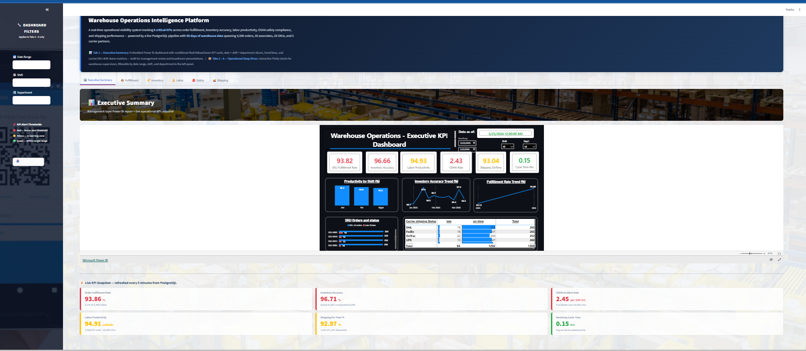
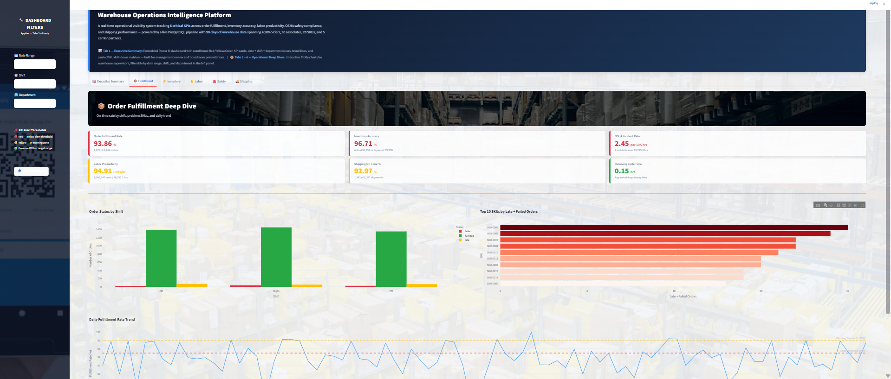
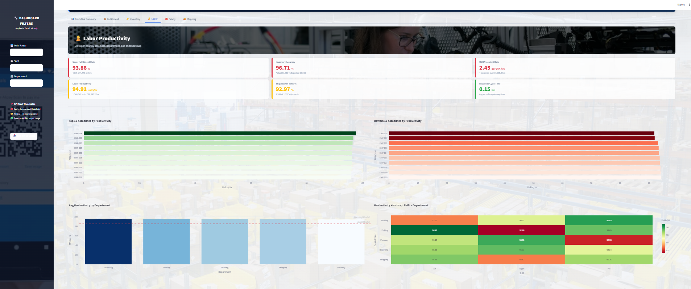
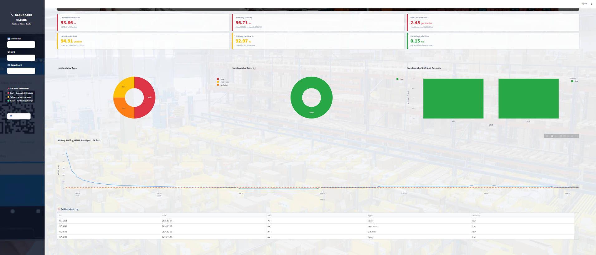
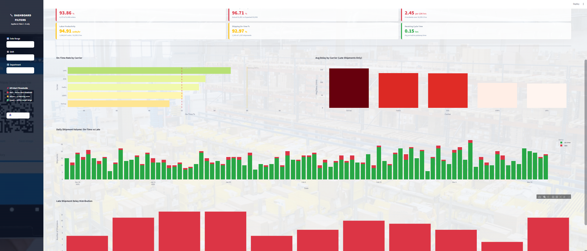
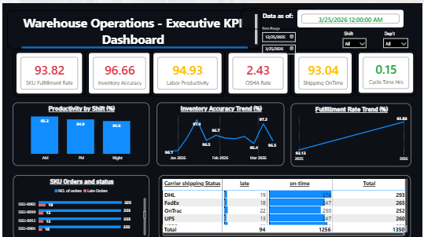

#  Warehouse Operations Intelligence Platform

**By Haribabu Ambati** — MSBA Student | Former Transportation Specialist, Middle-Mile Operations

---

## Why I Built This

For 3 years I worked as a Transportation Specialist in middle-mile operations — monitoring ultra-critical same-day loads across the USA and Canada, coordinating from India, across time zones, through peak seasons and the kind of high-pressure scenarios where one missed sort load cascades into a recovery operation, a transload, or worse, an impound.

My day-to-day was running deep root cause analysis on critical load failures, drafting reports for leaders across multiple geographies, and implementing process changes to make sure the same miss didn't happen twice. I trained 3 Leads and 16 associates, ran 30+ refresher sessions on same-day criticalities, and over the course of my time there contributed to roughly $2M+ in annual cost savings and a 3% improvement in delivery efficiency.

I knew this space from the inside. And the one thing I kept running into — across peak, non-peak, and every high-hiccup scenario in between — was that the people making decisions on the floor were reading yesterday's data. By the time a supervisor opened the report that flagged a problem, the shift had already ended. The late load had already left. The associate who processed 40% fewer units than everyone else had already clocked out. The inventory discrepancy that should have triggered a recount had already turned into a fulfillment failure.

The data existed in real time. Nobody was surfacing it in real time.

This project is my answer to that. It's built the way I wish our tools had worked — a live pipeline that calculates the 6 KPIs that actually matter on a warehouse floor, flags them the moment they go out of range, and presents them in a format that both a floor supervisor and a VP can read without a training session. The insight I carried from operations was simple: if you give the source the right information at the right time, the solutions get dramatically better. This dashboard is that idea, built into code.

---

## What You're Looking At
## Dashboard Screenshots

### Executive Summary — Power BI Embedded + Live KPI Snapshot


### Order Fulfillment Deep Dive


### Labor Productivity — Shift × Department Heatmap


### OSHA Instances — safety outlook


### Shipping & Receiving Deep Dive


### Power BI Executive Report


---

## 🔗 Live Demo

| Resource | Link |
|----------|------|
| Power BI Executive Report (live) | [Open Report](https://app.powerbi.com/view?r=eyJrIjoiNTVhMzEzOWEtZjM4NC00MWM4LTgwOTYtNGM1OTRhMWJkMjMxIiwidCI6ImUwNWI2YjNmLTE5ODAtNGIyNC04NjM3LTU4MDc3MWY0NGRlZSIsImMiOjN9) |
| GitHub Repository | [warehouse-intelligence-portfolio](https://github.com/ambtiharibabu/Warehouse-intelligence-portfolio) |


When you open this dashboard you see two layers built on top of the same live PostgreSQL database:

**Layer 1 — Executive (Tab 1):** A Power BI report embedded inside the app. Six KPI cards that turn red, yellow, or green based on real thresholds. Slicers for date range, shift, and department. Trend lines and carrier/SKU matrices for anyone who wants to drill deeper. Built for the kind of weekly ops review meeting where a manager needs numbers they can defend.

**Layer 2 — Operational (Tabs 2–6):** Five Streamlit tabs with interactive Plotly charts — one per domain. Fulfillment by shift and SKU. Inventory accuracy by category. Labor productivity per associate. OSHA incident trend. Carrier on-time rates. These are the charts a supervisor would have open during their shift, not just at end of day.

Both layers update from the same data. No copy-pasting between systems. No stale numbers.

---

## The 6 KPIs — and Why These Six

I didn't pick these randomly. These are the six numbers that come up in every warehouse ops conversation I've been part of:

| KPI | What It Measures | 🔴 Alert | 🟡 Warning |
|-----|-----------------|----------|------------|
| Order Fulfillment Rate | % of orders shipped on time | < 95% | < 98% |
| Inventory Accuracy | Physical count vs system count | < 97% | < 99% |
| Labor Productivity | Units processed per hour worked | < 85 u/hr | < 95 u/hr |
| OSHA Incident Rate | Safety incidents per 10,000 hrs worked | > 1.5 | > 1.0 |
| Shipping On-Time % | % of outbound shipments departing on schedule | < 92% | < 96% |
| Receiving Cycle Time | Average time from scheduled to actual departure | > 4 hrs | > 3 hrs |

Any one of these going red on its own is a problem. Two or more going red at the same time usually means something systemic — a shift staffing issue, a carrier SLA breach, a systems failure. This dashboard makes that visible in seconds instead of hours.

---

## How It's Built

```
PostgreSQL Database (DigitalOcean)
         ↑
generate_data.py  ──►  Faker synthetic data → 5 tables, 8,000+ rows
         ↓
kpi_engine.py     ──►  SQL queries → 6 calculated KPI values
         ↓
alerts.py         ──►  Threshold logic → Red / Yellow / Green flags
         ↓
┌─────────────────────────────────────────┐
│           Streamlit Application         │
│                                         │
│  Tab 1 → Power BI embedded report       │  ← Management layer
│  Tab 2 → Fulfillment deep dive          │
│  Tab 3 → Inventory accuracy             │  ← Supervisor layer
│  Tab 4 → Labor productivity             │
│  Tab 5 → Safety & compliance            │
│  Tab 6 → Shipping & receiving           │
│                                         │
│  Sidebar → Date / Shift / Dept filters  │
│          → Export to Excel button       │
└─────────────────────────────────────────┘
```

---

## The Data

This project uses synthetic data generated with Python's Faker library — realistic enough to demonstrate all the KPI logic and alert conditions, scaled to represent a mid-size warehouse operation:

- **4,500 orders** across 90 days, 20 SKUs, 3 shifts
- **1,943 labor records** for 30 associates across 5 departments
- **1,350 shipments** across 5 carriers (FedEx, UPS, DHL, USPS, OnTrac)
- **240 inventory cycle count records** across 20 SKUs
- **4 safety incidents** — realistic low frequency for a well-run operation

The data is calibrated so the dashboard shows a real mix of red, yellow, and green KPIs — because a dashboard where everything is green isn't testing anything.

---

## Project File Structure

```
project1-kpi-dashboard/
│
├── db/
│   ├── schema.sql              ← SQL to create all 5 tables
│   ├── generate_data.py        ← Synthetic data generator
│   ├── run_schema.py           ← Runs schema.sql against PostgreSQL
│   └── export_for_powerbi.py   ← Exports tables to CSV for Power BI
│
├── charts/
│   ├── __init__.py
│   ├── fulfillment_charts.py   ← 3 charts: shift, SKU, daily trend
│   ├── inventory_charts.py     ← 3 charts: trend, worst SKUs, category
│   ├── labor_charts.py         ← 4 charts: associates, dept, heatmap
│   ├── safety_charts.py        ← 4 charts + incident log table
│   └── shipping_charts.py      ← 4 charts: carrier, volume, delays
│
├── powerbi/
│   ├── warehouse_kpi.pbix      ← Power BI Desktop file
│   └── *.csv                   ← Data exports used as Power BI source
│
├── kpi_engine.py               ← Core KPI calculation logic
├── alerts.py                   ← Threshold evaluation → color flags
├── export_utils.py             ← Multi-sheet Excel export builder
├── dashboard.py                ← Main Streamlit application
├── requirements.txt            ← Python dependencies
└── README.md                   ← You are here
```

---

## Running This Yourself

**Prerequisites:** Python 3.11+, a PostgreSQL database, Power BI Desktop (for the .pbix file)

**1. Clone the repository**
```bash
git clone https://github.com/ambtiharibabu/warehouse-intelligence-portfolio.git
cd warehouse-intelligence-portfolio/project1-kpi-dashboard
```

**2. Set up virtual environment**
```bash
python -m venv venv
venv\Scripts\activate        # Windows
source venv/bin/activate     # Mac / Linux
```

**3. Install dependencies**
```bash
pip install -r requirements.txt
```

**4. Create your .env file**

Make a file called `.env` in the project root with your database credentials:
```
DB_HOST=your-database-host
DB_PORT=5432
DB_NAME=your-database-name
DB_USER=your-username
DB_PASSWORD=your-password
DB_SSLMODE=disable
```

**5. Create tables and load data**
```bash
python db/run_schema.py
python db/generate_data.py
```

**6. Verify the KPI engine works**
```bash
python kpi_engine.py
python alerts.py
```

You should see 6 KPI values and their Red/Yellow/Green status printed in the terminal.

**7. Launch the dashboard**
```bash
streamlit run dashboard.py
```

Open `http://localhost:8501` in your browser.

---

## Tech Stack

| What | Tool |
|------|------|
| Database | PostgreSQL on DigitalOcean |
| Data generation | Python, Faker |
| KPI calculations | Python, pandas, SQLAlchemy |
| Operational dashboard | Streamlit, Plotly Express |
| Executive dashboard | Power BI Desktop + Power BI Service |
| Data validation | DBeaver |
| Version control | Git + GitHub |

---

## What I Learned Building This

A few honest reflections from someone coming from an operations background rather than a software engineering one:

The hardest part wasn't the code — it was the data calibration. Getting the OSHA incident rate to produce a realistic number required understanding that the 200,000-hour constant in the standard OSHA formula assumes a 100-person workforce running a full year. With 30 associates over 90 days, you need the per-10,000-hour variant instead. That kind of domain knowledge — knowing which formula applies to which scale of operation — is something you only develop by working in the field, not by reading about it.

The second thing that surprised me was how much of a data project is actually data *design* — deciding what columns to capture, what granularity to store, what the schema should look like before a single line of Python is written. Getting that right upfront meant everything downstream was clean.

The Power BI layer was genuinely harder to connect than expected because of SSL configuration differences between managed cloud databases and self-managed Droplets. Real-world friction that doesn't show up in tutorials.

---

## About Me

I'm Haribabu Ambati — currently pursuing an MSBA, and coming into it with 3 years of real middle-mile operations experience as a Transportation Specialist supporting same-day critical loads across the USA and Canada from India.

My operations background wasn't analytical in title but it was deeply analytical in practice — constant root cause analysis, cross-geography stakeholder reporting, process design, peak season triage, and training teams to handle the scenarios where everything goes wrong at once. I was an Active Trainer and SME for my department, responsible for cross-training 3 Leads and 16 associates on same-day criticalities, and the work my team did translated into measurable outcomes: $2M+ in annual cost savings and a 3% improvement in delivery efficiency.

The MSBA is where I'm building the technical layer on top of that foundation — turning operational instincts into data systems, dashboards, and eventually ML-powered tools. This portfolio is that work in progress. Three projects, one database, one supply chain domain I know from the inside out.

**GitHub:** [github.com/ambtiharibabu](https://github.com/ambtiharibabu)

---

## What's Coming Next

This is **Project 1 of 3** in the warehouse-intelligence-portfolio:

| Project | What It Builds | Status |
|---------|---------------|--------|
| **Project 1 — Warehouse KPI Dashboard** | Real-time KPI pipeline + dual-layer dashboard | ✅ Complete |
| **Project 2 — Demand Forecasting Pipeline** | Reads from this PostgreSQL DB, adds ML forecast tables, forecasts SKU-level demand | 🔜 In progress |
| **Project 3 — Supply Chain RAG Chatbot** | LLM + retrieval system that answers ops questions from the live data | 🔜 Coming next |

Projects 2 and 3 are built on top of the same database this project creates — the pipeline compounds.
