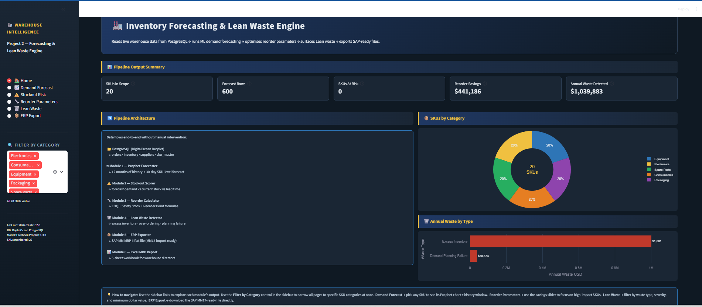
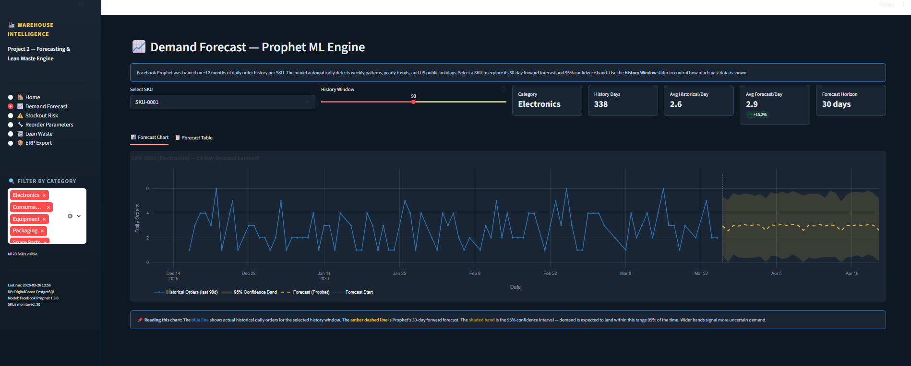
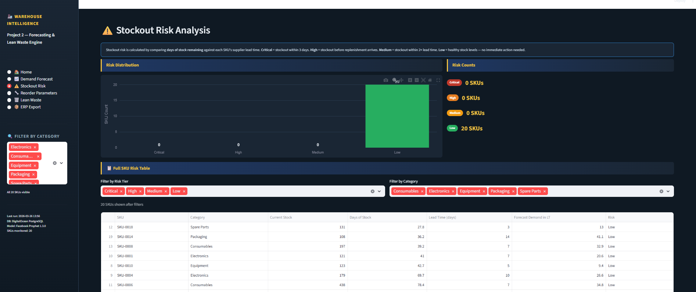
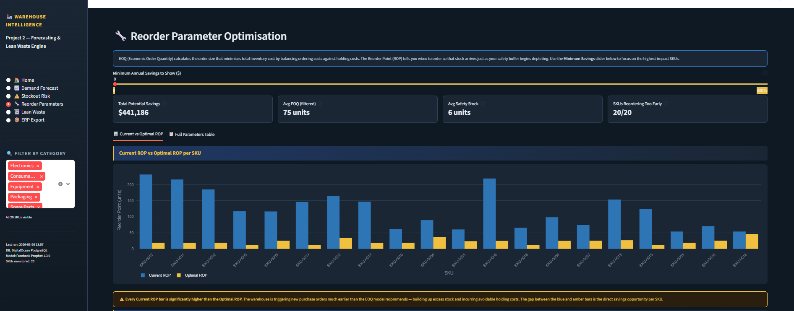
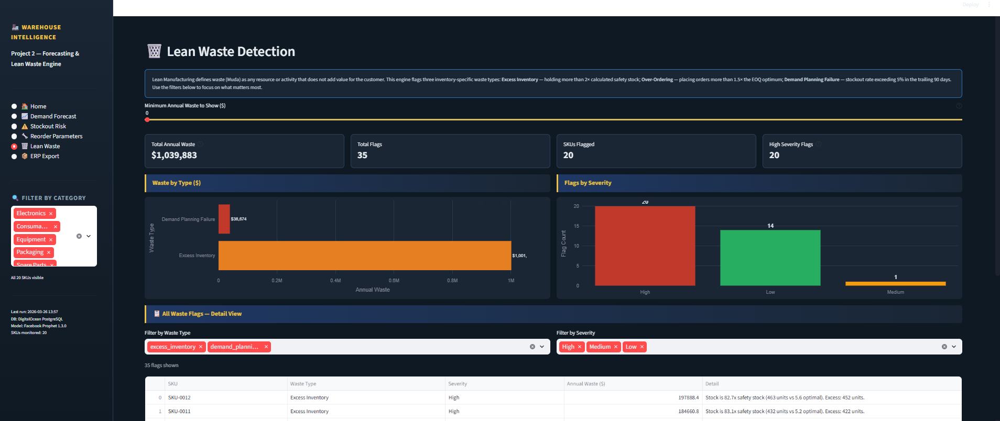
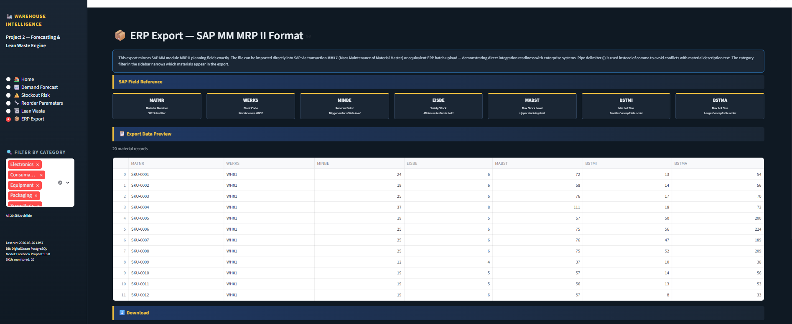

# 🏭 Warehouse Inventory Forecasting & Lean Waste Detection Engine

> *"Manual reorder point spreadsheets cost warehouses 8–12% of inventory value
> annually through excess stock or lost sales. This engine reads directly from a
> live warehouse PostgreSQL database, runs ML-powered demand forecasting, optimises
> reorder parameters using EOQ modelling, and surfaces Lean waste — outputting
> results back to the database and as SAP-compatible ERP flat files."*

🌐 **Live Dashboard:** [Streamlit App](https://hari-warehouse-p2.streamlit.app)

*(Requires active database connection — if you see a connection error,
the DigitalOcean Droplet may be offline. See screenshots below for a
full walkthrough.)*

---

## What This Project Does — In Plain English

Imagine a warehouse running on gut feel and spreadsheets. The team reorders
stock when it "looks low," carries months of inventory on some SKUs while
running out of others, and has no idea how much that costs them every year.

This pipeline fixes that. It connects directly to the warehouse's live
PostgreSQL database, reads 12 months of order history, and runs a full
inventory intelligence cycle — automatically, end to end, with one command.

The result: **$1,039,883 in identified annual waste** and **$441,186 in
reorder optimisation savings** across 20 SKUs — with every number traceable
back to a formula, a data row, and a business decision.

---

## The Numbers (From a Live Run)

| Metric | Value |
|---|---|
| SKUs analysed | 20 |
| Forecast rows generated | 600 (20 SKUs × 30 days) |
| Total identified annual waste | $1,039,883 |
| Reorder optimisation savings | $441,186 |
| Waste flags raised | 35 |
| High severity flags | 20 |
| SAP material records exported | 20 |
| Excel MRP report sheets | 5 |

---

## Architecture — How Data Flows
```
PostgreSQL (DigitalOcean Droplet)
  Tables: orders · inventory · suppliers · sku_master
          shipments · labor · safety_incidents
         ↓
┌─────────────────────────────────────────────────────┐
│  Module 1 — Prophet Forecaster                      │
│  12 months of daily order history → 30-day forecast │
│  Output: forecasts table (600 rows)                 │
├─────────────────────────────────────────────────────┤
│  Module 2 — Stockout Scorer                         │
│  Forecast demand vs current stock vs lead time      │
│  Output: reorder_params (risk tier per SKU)         │
├─────────────────────────────────────────────────────┤
│  Module 3 — Reorder Calculator                      │
│  EOQ + Safety Stock + Reorder Point formulas        │
│  Output: reorder_params (EOQ, ROP, savings)         │
├─────────────────────────────────────────────────────┤
│  Module 4 — Lean Waste Detector                     │
│  3 waste type flags: excess · over-order · planning │
│  Output: lean_waste_flags (35 flags, $1M+ waste)    │
├─────────────────────────────────────────────────────┤
│  Module 5 — ERP Exporter                            │
│  SAP MM MRP II flat file (MM17 import ready)        │
│  Output: erp_export_log + CSV                       │
├─────────────────────────────────────────────────────┤
│  Module 6 — Excel MRP Report                        │
│  5-sheet workbook for warehouse directors           │
│  Output: reports/mrp_report_YYYYMMDD.xlsx           │
└─────────────────────────────────────────────────────┘
         ↓
Streamlit Dashboard (app.py)
  6 pages · global category filter · download buttons
```

---

## Module Breakdown

### Module 1 — Demand Forecaster (`modules/forecaster.py`)
Facebook Prophet trains one model per SKU on ~12 months of daily order
history. The model detects weekly seasonality (day-of-week patterns),
yearly trends, and US public holidays. Output is a 30-day forward forecast
with 95% confidence bands, written to the `forecasts` table in PostgreSQL.

### Module 2 — Stockout Scorer (`modules/stockout_scorer.py`)
Compares days-of-stock-remaining against each SKU's supplier lead time.
If current stock won't last until the next replenishment arrives, the SKU
is flagged. Risk tiers: **Critical** (< 3 days), **High** (< lead time),
**Medium** (< 2× lead time), **Low** (healthy).

### Module 3 — Reorder Calculator (`modules/reorder_calculator.py`)
Runs three supply chain formulas per SKU:
- **EOQ** = √(2DS/H) — optimal order quantity
- **Safety Stock** = Z × σ(demand) × √(lead time) at 95% service level
- **Reorder Point** = (avg daily demand × lead time) + safety stock

Compares calculated optimal ROP against current behaviour and estimates
annual savings from closing the gap.

### Module 4 — Lean Waste Detector (`modules/lean_detector.py`)
Flags three Lean waste types per SKU:
- **Excess Inventory** — current stock > 2× calculated safety stock
- **Over-Ordering** — effective order qty > 1.5× EOQ
- **Demand Planning Failure** — stockout rate > 5% in trailing 90 days

Each flag carries a severity (Low/Medium/High) and an annual dollar cost.

### Module 5 — ERP Exporter (`modules/erp_exporter.py`)
Formats reorder parameters as a SAP MM MRP II flat file. Column names
mirror SAP's exact field codes (MATNR, WERKS, MINBE, EISBE, MABST,
BSTMI, BSTMA). Output is pipe-delimited and importable directly into
SAP via transaction MM17 — demonstrating direct ERP integration readiness.

### Module 6 — Excel MRP Report (`modules/excel_reporter.py`)
Builds a formatted 5-sheet Excel workbook using openpyxl:
1. Executive Summary — headline KPIs
2. Forecast Results — 30-day demand table per SKU
3. Reorder Parameters — current vs optimal ROP + savings
4. Lean Waste Flags — all flagged SKUs with $ impact
5. SAP Export — MRP II flat file formatted for ERP import

---

## Dashboard Screenshots

### 🏠 Home — Pipeline Summary


### 📈 Demand Forecast — Prophet ML Engine


### ⚠️ Stockout Risk Analysis


### 🔧 Reorder Parameter Optimisation


### 🗑️ Lean Waste Detection


### 📦 ERP Export — SAP MM MRP II Format


---

## Tech Stack

| Layer | Tool | Purpose |
|---|---|---|
| Language | Python 3.12 | Core pipeline |
| Database | PostgreSQL (DigitalOcean Droplet) | Live data store |
| ORM | SQLAlchemy + psycopg2 | DB connection |
| Forecasting | Facebook Prophet 1.3.0 | Demand forecasting |
| Data | pandas 2.3.3 | Data manipulation |
| Maths | numpy, scipy | EOQ + safety stock formulas |
| Charts | Plotly | Interactive visualisations |
| Dashboard | Streamlit | Operational web app |
| Excel | openpyxl | MRP report generation |
| ERP | SAP MM format | MRP II flat file export |
| ML support | scikit-learn | Forecast accuracy metrics |
| Env | python-dotenv | Credential management |
| Data gen | Faker | Synthetic seed data |

---

## How to Run Locally

### 1. Clone the repo
```bash
git clone https://github.com/ambtiharibabu/warehouse-intelligence-portfolio.git
cd project2-forecasting
```

### 2. Create and activate virtual environment
```bash
python -m venv venv
venv\Scripts\activate        # Windows
# source venv/bin/activate   # Mac/Linux
```

### 3. Install dependencies
```bash
pip install -r requirements.txt
```

### 4. Create your `.env` file
```env
DB_HOST=your_host
DB_PORT=5432
DB_NAME=your_db
DB_USER=your_user
DB_PASSWORD=your_password
DB_SSLMODE=disable
```

### 5. Seed the database (first time only)
```bash
python db/seed_p2_tables.py
```

### 6. Run the full pipeline
```bash
python main.py
# or skip Prophet if forecasts already exist:
python main.py --skip-forecast
```

### 7. Launch the dashboard
```bash
streamlit run app.py
```

---

## Project File Structure
```
project2-forecasting/
│
├── main.py                      ← Full pipeline orchestrator (one command)
├── app.py                       ← Streamlit dashboard (6 pages)
├── requirements.txt             ← All dependencies with versions
├── README.md                    ← This file
├── .env                         ← DB credentials (never pushed to GitHub)
├── .gitignore                   ← Protects .env, venv/, reports/
│
├── db/
│   ├── connection.py            ← Shared SQLAlchemy engine (local + cloud)
│   └── seed_p2_tables.py        ← Generates suppliers, sku_master, order backfill
│
├── modules/
│   ├── forecaster.py            ← Prophet: 30-day demand forecast per SKU
│   ├── stockout_scorer.py       ← Stockout risk tier per SKU
│   ├── reorder_calculator.py    ← EOQ + Safety Stock + ROP formulas
│   ├── lean_detector.py         ← 3 Lean waste type flags
│   ├── erp_exporter.py          ← SAP MM MRP II flat file export
│   └── excel_reporter.py        ← 5-sheet Excel MRP report builder
│
├── reports/                     ← Generated outputs (not pushed to GitHub)
│   ├── mrp_report_YYYYMMDD.xlsx
│   └── sap_mrp_export_YYYYMMDD.csv
│
└── screenshots/                 ← Dashboard screenshots for README
    ├── screenshot_01_home.png
    ├── screenshot_02_forecast.png
    ├── screenshot_03_stockoutrisk.png
    ├── screenshot_04_reorderparameters.png
    ├── screenshot_05_Leanwaste.png
    └── screenshot_06_ERPexport.png
```

---

## PostgreSQL Tables — Project 2 Additions

These 4 tables are created and populated by this pipeline on top of
Project 1's existing 5 tables (orders, inventory, labor, shipments,
safety_incidents):
```sql
-- Prophet forecast output — 30 days per SKU
forecasts (
    sku           VARCHAR,
    forecast_date DATE,
    yhat          FLOAT,      -- predicted demand
    yhat_lower    FLOAT,      -- 95% confidence lower bound
    yhat_upper    FLOAT,      -- 95% confidence upper bound
    model_used    VARCHAR,
    generated_at  TIMESTAMP
)

-- Reorder optimisation parameters — one row per SKU
reorder_params (
    sku                   VARCHAR PRIMARY KEY,
    current_stock         FLOAT,
    avg_daily_forecast    FLOAT,
    days_of_stock         FLOAT,
    lead_time_days        INT,
    forecast_demand_in_lt FLOAT,
    stockout_risk         VARCHAR,   -- Critical/High/Medium/Low
    eoq                   FLOAT,
    safety_stock          FLOAT,
    current_rop           FLOAT,
    optimal_rop           FLOAT,
    gap                   FLOAT,
    potential_savings_usd FLOAT,
    updated_at            TIMESTAMP
)

-- Lean waste flags — multiple rows per SKU
lean_waste_flags (
    sku              VARCHAR,
    waste_type       VARCHAR,   -- excess_inventory/over_ordering/demand_planning_failure
    severity         VARCHAR,   -- Low/Medium/High
    annual_waste_usd FLOAT,
    detail           VARCHAR,
    flagged_at       TIMESTAMP
)

-- Audit log of every SAP export run
erp_export_log (
    export_date  TIMESTAMP,
    sku_count    INT,
    file_path    VARCHAR,
    exported_by  VARCHAR
)
```

---

## SAP ERP Integration Note

Output columns mirror SAP MM module MRP II planning fields
(MATNR, WERKS, MINBE, EISBE, MABST, BSTMI, BSTMA).
This file can be imported directly into SAP via transaction MM17
or equivalent ERP batch upload — demonstrating direct integration
readiness with enterprise systems. Compatible with SAP ECC 6.0,
SAP S/4HANA, and any ERP system supporting MRP II flat file import.

---

## Related Projects

This is **Project 2** of a 3-part Warehouse Intelligence Portfolio:

- **Project 1** — KPI Dashboard (Power BI + Streamlit) →
  [warehouse-intelligence-portfolio](https://github.com/ambtiharibabu/warehouse-intelligence-portfolio)
- **Project 2** — Inventory Forecasting & Lean Waste Engine ← *You are here*
- **Project 3** — RAG Pipeline (coming soon)

---

## Author

**Hari Babu** — Supply Chain & Operations Professional
transitioning into data-driven operations roles.

[GitHub](https://github.com/ambtiharibabu) ·
[LinkedIn](https://linkedin.com/in/your-profile)